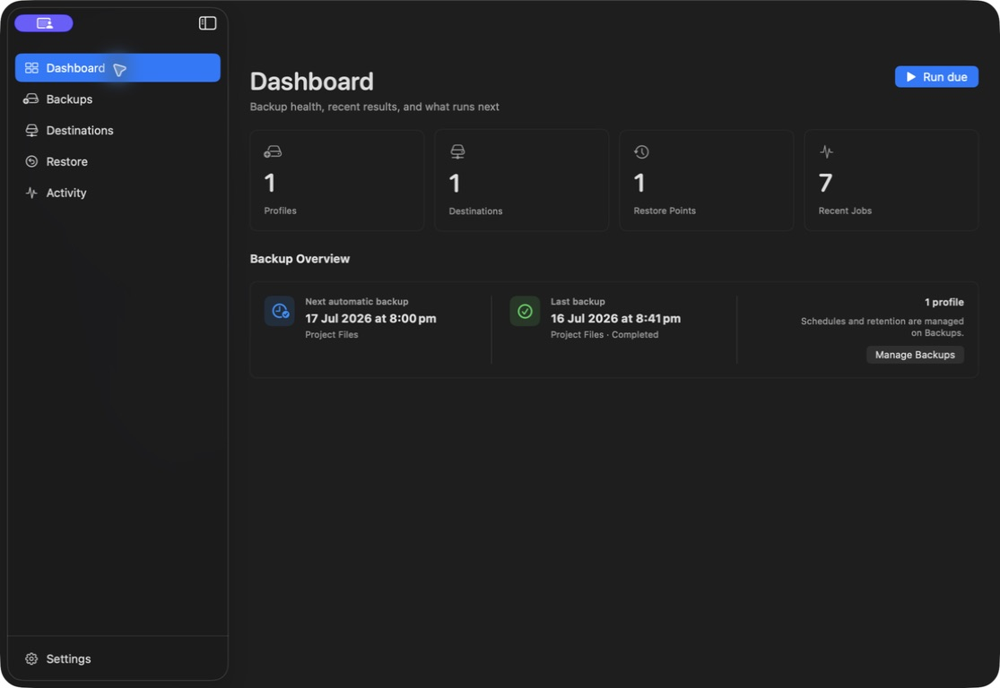
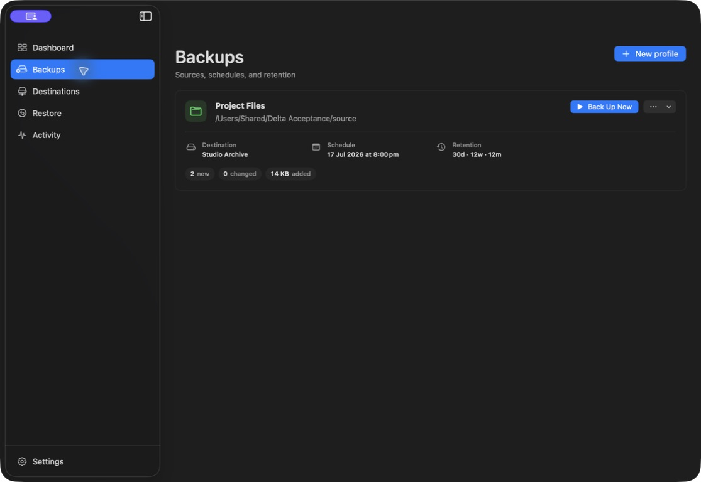
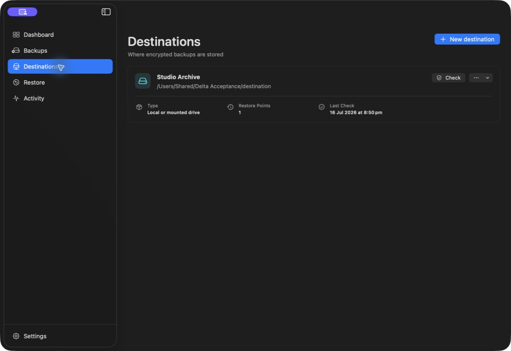
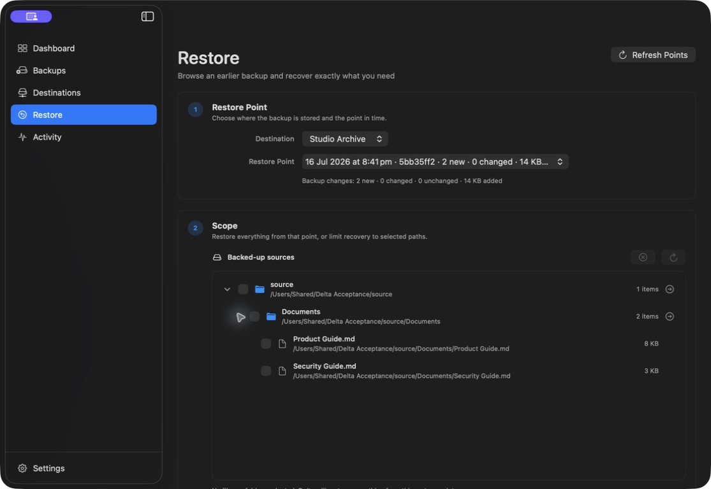
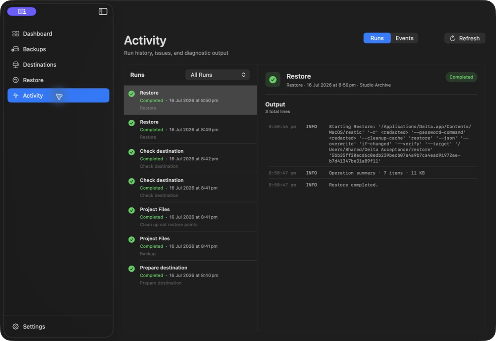
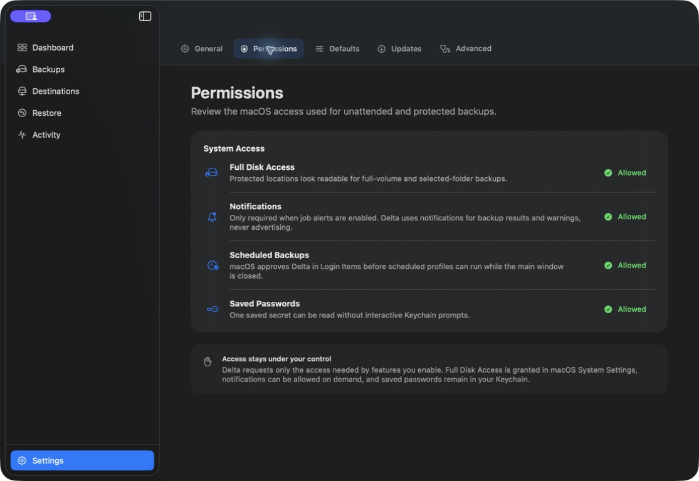

# Delta

Delta is a native encrypted backup and restore manager for macOS 26. It gives [restic](https://restic.net/)'s incremental, deduplicated repository format a focused Mac interface for choosing what to protect, scheduling unattended work, inspecting every result, maintaining destinations, and restoring individual files or complete backup points.

[](https://github.com/dbuskariol/delta/actions/workflows/ci.yml)
[](https://github.com/dbuskariol/delta/releases/latest)




Delta creates file-level backups. It is not a bootable clone, a block-level disk image, Time Machine, or a hosted backup service.

## Know what is protected

Each backup profile keeps its source, destination, schedule, retention rules, power policy, exclusions, speed limits, and most recent result together. Delta validates the source and saved credentials before starting, serializes work for each destination, and asks restic to encrypt, compress, incrementally store, and deduplicate the selected data.



- Back up selected folders or one readable filesystem volume.
- Run manually or on hourly, daily, weekly, monthly, and interval schedules.
- Catch up one missed run after sleep, disconnection, or an unavailable destination.
- Control battery and Low Power Mode behavior without changing a schedule.
- Keep hourly, daily, weekly, monthly, and yearly restore points, then prune unreferenced data and optionally check the repository.
- See new, changed, unchanged, and added-byte counts without treating an unchanged run as a failure.
- Preserve restic exit codes, warnings, unreadable-file evidence, and issue history instead of overstating protection.

## Store encrypted backups where they belong



Every destination uses restic's encrypted repository format. Delta prepares new repositories, checks existing ones, tracks restore points, guards concurrent operations, and keeps provider credentials in the login Keychain.

| Destination | Delta behavior |
| --- | --- |
| Local folder or removable disk | Uses a native folder selection and a directly accessible filesystem path |
| Mounted SMB or NFS volume | Uses the volume after macOS or Finder has mounted it; macOS owns the network mount |
| SFTP | Connects with host, path, username, port, and optional SSH identity settings |
| S3-compatible object storage | Supports endpoint, bucket, path, region, access key, and secret key settings |
| Backblaze B2, Azure Blob, Google Cloud Storage, OpenStack Swift | Exposes the credentials and repository fields required by restic |
| REST server | Connects to a restic REST repository URL with optional credentials |
| rclone remote | Uses the bundled rclone transport for an already configured remote |
| Advanced restic URL | Accepts a user-managed backend URL for interoperable configurations |

Provider availability, credentials, server policy, latency, and storage charges remain outside Delta's control. A mounted NAS must be connected before its profile can run; a cloud destination still needs a valid provider account and network path.

## Restore without guessing



Restore starts with a repository and a concrete point in time. Expand its backed-up sources, select any combination of files and folders, and preview the operation before Delta writes data.

- Restore everything, one folder, or individual files.
- Choose a separate destination or explicitly acknowledge an in-place restore.
- Preview by default, then choose skip, replace-changed, or overwrite behavior.
- Verify restored content after a real write.
- Create an optional pre-restore backup before an in-place operation.
- Refresh restore points and repository contents without losing the selected destination context.

Delta reports success only after the underlying restore exits successfully. For high-value recovery, independently open or hash representative restored files before relying on the result.

## Inspect every operation



Activity keeps backup, restore, destination preparation, check, and cleanup results in one place. Live process output is bounded so a noisy backend cannot exhaust app memory; parsed summaries remain available while secrets, password commands, and credential-bearing repository URLs are redacted.

A completed backup with unreadable or omitted files remains technically incomplete. Delta preserves the evidence, groups actionable issues, and allows a reviewed omission to be acknowledged without erasing it from history. Cleanup requires confirmation, applies the profile's retention rules to the selected destination, and runs the configured post-cleanup check before presenting the final result.

## Native Mac controls



Delta uses native SwiftUI navigation, toolbars, menus, alerts, file pickers, settings, keyboard focus, and accessibility descriptions. The optional menu-bar control keeps Back Up Now, Run Due Backups, Pause, Resume, Stop, Activity, Updates, and main-window access available while the window is closed.

Use **Command-,** to open Settings and **Command-1** through **Command-5** to move between Dashboard, Backups, Destinations, Restore, and Activity. The same destinations, profiles, jobs, and controls are used by the window, menus, and signed background agent.

Settings covers scheduling, power behavior, notifications, login, permissions, health thresholds, new-profile defaults, restore safety, retention, signed updates, diagnostics, and saved history. The Permissions page explains the current access state without pretending that an approval exists when macOS has not granted it.

## Encryption and credentials

Restic encrypts repository metadata and file content before storage. Delta can generate a high-entropy repository password or save a user-supplied passphrase. Destination passwords and provider secrets remain in the login Keychain; scheduled reads prohibit interactive prompts and fail closed when the signed app or background agent cannot access the saved item.

Losing a user-managed repository password means losing access to that repository. Delta cannot bypass restic encryption. Password rotation stages and verifies a new restic key before retiring the previous key, with rollback designed to leave the repository usable if an intermediate step fails.

## Permissions and privacy

Delta does not collect analytics, advertising identifiers, backup contents, credentials, or usage data. The bundled privacy manifest declares no tracking and no collected data. Network activity is limited to the signed GitHub release feed and the backup destinations you configure.

| macOS access | When it is needed |
| --- | --- |
| Selected files and folders | Custom sources, restore targets, local destinations, and SSH key selection |
| Full Disk Access | Optional for a full-volume backup or protected folders macOS otherwise prevents Delta from reading |
| Login Items | Required only when Scheduled Backups is enabled so macOS can run Delta's signed agent |
| Notifications | Optional for job alerts and success summaries |
| Keychain | Required to save repository passwords and remote-provider credentials |

Delta does not require administrator privileges, Accessibility, Screen Recording, Camera, Microphone, Contacts, or Location access. Read [SECURITY.md](SECURITY.md) for the trust model, secret handling, diagnostics policy, and vulnerability reporting.

## Architecture

| Component | Responsibility |
| --- | --- |
| `Delta` | SwiftUI app, AppKit status item, workflows, settings, diagnostics, and Sparkle updates |
| `DeltaAgent` | Signed Login Item agent that evaluates due work and exits |
| `DeltaCore` | Models, policy, SQLite/GRDB persistence, scheduling, command construction, parsing, process control, and Keychain integration |
| `DeltaSecretBridge` | Restricted helper path for noninteractive destination-password reads |
| `restic` | Encrypted repository format, snapshots, deduplication, restore, retention, and checks |
| `rclone` | Optional transport for additional remote storage providers |

Operational configuration, audit history, and local control state live under `~/Library/Application Support/Delta`. Secrets remain in Keychain, and backup data remains at the configured destination. See [Documentation/ARCHITECTURE.md](Documentation/ARCHITECTURE.md) for process boundaries, repository locking, persistence, scheduling, and data flow.

## Install

Delta requires macOS 26 or later.

1. Download the notarized DMG from the [latest release](https://github.com/dbuskariol/delta/releases/latest).
2. Open the DMG and drag Delta to Applications.
3. Open Delta from Applications, add a destination, and create the first backup profile.
4. Run the profile once, inspect Activity, and perform a test restore before considering the setup complete.

Public releases also include a signed ZIP for Sparkle updates, `SHA256SUMS`, external release notes, and a machine-readable provenance manifest.

## Build and verify

Requirements:

- macOS 26 or later
- Xcode 26.5 or later
- Swift 6.2 or later
- Network access for initial package resolution and bundled-tool bootstrap

```sh
Scripts/bootstrap-tools.sh
swift test
Scripts/verify-ci.sh
```

`Scripts/verify-ci.sh` is the certificate-free CI gate. It checks Swift tests, Debug and Release builds, strict metadata and privacy configuration, scripts, bundled tools, product language, packaged-app behavior, deterministic restic lifecycles, and fail-closed release assumptions. GitHub executes the same gate on native Apple-silicon and Intel macOS 26 runners.

Identity-sensitive acceptance uses a stable Apple Development or Developer ID-signed app installed in `/Applications`. Replacing it with an ad-hoc or differently signed build can invalidate Keychain access and macOS privacy approvals. Use the guarded installer only with an intended stable identity:

```sh
Scripts/build-release.sh
Scripts/install-app.sh dist/Delta.app
```

The installer verifies the bundle identifier, minimum macOS version, signing team, designated requirement, and post-install bundle before replacing the installed app. Release distribution remains a separate, stricter process.

## Release trust

Delta's release pipeline is fail closed. It builds a universal hardened-runtime archive, verifies nested code, requires Developer ID signing, notarizes and staples the app and DMG, signs the Sparkle ZIP with EdDSA, validates the appcast and external release notes, checks Gatekeeper, records checksums and provenance, and preserves private dSYM and Apple evidence before publication.

No locally signed build should be described as a public release candidate until the manual acceptance matrix, genuine required external-backend evidence, notarization, stapling, Gatekeeper, Sparkle, and production-readiness gates pass for that exact bundle and CDHash. See [Documentation/RELEASING.md](Documentation/RELEASING.md).

## Recovery expectations and limitations

- Delta protects files through restic restore points; it does not make a Mac bootable or restore the operating system itself.
- A backup is only one copy. Keep at least one independent, preferably off-site destination and periodically test recovery from it.
- Delta cannot recover a lost repository password, repair a provider outage, or read data that macOS denied to the backup process.
- Disconnected drives, unmounted shares, expired cloud credentials, repository locks, insufficient free space, and offline servers block work and remain visible as failures or attention states.
- Cleanup can permanently remove old restore points and unreferenced repository data. Review retention rules, the selected profile, and the selected destination before confirming it.
- Removing a profile or destination from Delta does not delete its repository data, but removing the saved password can make reconnecting impossible unless that password is retained elsewhere.
- Backend support describes configurations Delta and restic can address; genuine provider acceptance still depends on the exact server, account, permissions, network, and release evidence.

## Updating and troubleshooting

Use **Settings → Updates** or **Updates** in the menu-bar panel. Delta checks a signed appcast, verifies the EdDSA archive signature before extraction, and accepts only appropriately signed and notarized application updates. The notarized DMG remains the manual recovery path.

- **A source is unavailable:** reselect it, confirm the drive is mounted, then review filesystem permissions and Full Disk Access if protected data is involved.
- **A scheduled backup did not run:** update to Delta 0.3.2 or later, confirm Scheduled Backups is enabled and approved in Login Items, then review pause, power, missed-run, source, destination, and saved-password status. Delta 0.3.2 repairs the stale missing-service registration that an earlier version could leave after an update; it does not require deleting profiles or backup data.
- **Saved Passwords needs repair:** use Settings → Permissions to review access and rewrite the Keychain access list for the currently signed Delta app.
- **A destination is unavailable or locked:** reconnect it, verify credentials, and ensure another restic client is not operating on the same repository.
- **An update is unavailable:** use Check Now, confirm network access to GitHub Releases, or install the notarized DMG manually.
- **Support needs evidence:** copy or export the sanitized diagnostic report from Settings. Known secrets, credential-bearing URLs, and personal home-directory names are redacted.

## Documentation

- [Architecture](Documentation/ARCHITECTURE.md)
- [Security and privacy](SECURITY.md)
- [Release process](Documentation/RELEASING.md)
- [Release notes](Documentation/RELEASE_NOTES.md)
- [Current verification report](Documentation/VERIFICATION_REPORT.md)
- [Backup-engine behavior](docs/RESTIC_COMPLIANCE.md)
- [Production acceptance](docs/PRODUCTION_READINESS.md)
- [Contributing](CONTRIBUTING.md)

## Status

Delta is in active development at version 0.3.0. The native backup, scheduling, destination, restore-browser, selective restore, retention, repository-check, Activity, diagnostics, permissions, menu-bar, background-agent, and signed-update architectures are implemented. Deterministic installed-app acceptance covers local repositories plus local REST, S3-compatible, SFTP, rclone, and mounted-volume protocol harnesses; those localhost harnesses are regression evidence, not substitutes for genuine external provider acceptance. Public production readiness still depends on current evidence for the exact release candidate, required genuine external backends, and all signing, Apple-service, notarization, stapling, Gatekeeper, Sparkle, and release-history gates.
