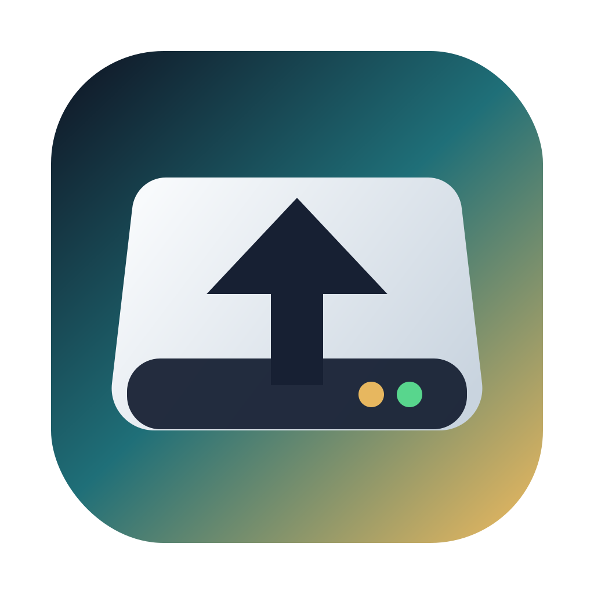

<div align="center">
  
  <h1>Delta</h1>
  <p><strong>Encrypted, incremental backups for macOS.</strong></p>
  <p>Native where it matters. Proven technology where your data matters.</p>

  [](https://github.com/dbuskariol/delta/actions/workflows/ci.yml)
  
  
  
</div>

> [!IMPORTANT]
> Delta is in active beta. It creates file-level backups, not bootable clones or block-level disk images. Developer ID notarization is the remaining external-distribution step.

## Overview

Delta brings serious backup practices into a focused native macOS app. It combines SwiftUI, Keychain, background scheduling, and a clear restore workflow with [restic](https://restic.net/), a proven encrypted and content-addressed backup engine.

Backups are encrypted by design, incremental after the first run, deduplicated across restore points, and usable across local, network, and cloud destinations.

## Highlights

| | Capability | What Delta provides |
| --- | --- | --- |
| :lock: | **Encrypted by default** | Every destination uses authenticated encryption. Passwords live in Keychain or are supplied by the user. |
| :arrows_counterclockwise: | **Incremental backups** | Content-defined deduplication, metadata tracking, compression, and unchanged-run detection. |
| :calendar: | **Reliable scheduling** | Hourly, daily, weekly, monthly, or custom schedules with missed-run catchup and power policies. |
| :file_folder: | **Flexible sources** | Protect selected folders or a complete readable volume with macOS-safe exclusions. |
| :globe_with_meridians: | **Local and remote storage** | External drives, mounted SMB/NFS shares, SFTP, object storage, REST, and rclone remotes. |
| :leftwards_arrow_with_hook: | **Complete restore workflow** | Browse restore points, expand folders, select individual items, preview changes, and restore safely. |
| :bar_chart: | **Live operational visibility** | Monotonic progress, streaming logs, saved run history, grouped issues, and concise change summaries. |
| :sparkles: | **Native macOS experience** | SwiftUI app, menu bar controls, Notification Center alerts, Keychain, Full Disk Access guidance, and Sparkle updates. |

## Backup Workflow

1. **Add a destination** for encrypted backup data.
2. **Choose what to protect**: custom folders or a full readable volume.
3. **Set the policy**: schedule, retention, bandwidth, battery, and Low Power Mode behavior.
4. **Run automatically or on demand** while Delta records progress and results.
5. **Restore with a guided workflow** whenever a complete backup or selected item is needed.

Delta prepares new destinations automatically and validates sources, destination availability, credentials, and locks before starting work.

## Destinations

| Type | Examples |
| --- | --- |
| Local and mounted | Internal paths, external drives, SMB, NFS |
| Secure shell | SFTP with SSH config, ssh-agent, or a selected private key |
| Object storage | S3-compatible, Backblaze B2, Azure Blob, Google Cloud Storage, OpenStack Swift |
| Services and remotes | restic REST server, rclone remotes, advanced custom URLs |

Remote credentials are stored in Keychain and passed only to the backup process through a curated environment. Scheduled jobs fail closed instead of opening interactive password prompts.

## Restore

Every restore uses the same deliberate flow:

1. Choose a destination and restore point.
2. Restore everything or browse an expandable file tree.
3. Select the original location or another folder.
4. Choose how existing files are handled.
5. Preview the operation, then restore and verify.

In-place restores require explicit confirmation and can offer a pre-restore backup first. Individual files and deeply nested folders can be selected without restoring the complete backup.

## Scheduling And Maintenance

Delta's signed background service runs scheduled backups while the main window is closed. It evaluates:

- destination and network availability
- missed-run catchup
- battery and Low Power Mode policies
- bandwidth limits
- per-destination concurrency locks
- retention and integrity-check windows

Automatic runs can be paused globally without disabling manual backups. Active backups can be paused, resumed, or stopped from either the app or menu bar.

Retention combines hourly, daily, weekly, monthly, and yearly keep rules with scheduled cleanup and optional post-cleanup integrity checks.

## Clear Results

Delta distinguishes between an operational failure and a completed backup with omitted items.

- New, changed, unchanged, added, and checked totals are saved with every backup.
- File-read problems retain their exact path, operation, and underlying cause.
- Reviewed recurring omissions can be acknowledged without deleting their audit trail.
- A run containing only known omissions appears as **Completed** with a quiet audit note.
- A new path or changed cause immediately restores the warning state.

The underlying backup-engine exit code and omitted-item details are never rewritten.

## Security Model

Delta is designed so unattended operation does not weaken secret handling:

- Encryption is always enabled.
- Destination passwords and backend credentials are stored in macOS Keychain.
- Scheduled secret reads prohibit user interaction and fail closed.
- Passwords are delivered through a short-lived password command, never command-line arguments.
- Sensitive values are redacted before logs or diagnostics are persisted.
- Password changes use a transactional add, verify, commit, and retire workflow.
- Per-destination locks prevent overlapping backup, restore, cleanup, and check operations.
- Diagnostics expose useful state while redacting known credentials and embedded URL secrets.

> [!WARNING]
> Losing a user-managed destination password means losing access to that encrypted backup. Delta cannot bypass the encryption design.

## Architecture

| Component | Responsibility |
| --- | --- |
| `Delta` | Native SwiftUI app, menu bar experience, backup and restore workflows, settings, diagnostics, and updates |
| `DeltaAgent` | Signed background scheduling service registered through macOS Service Management |
| `DeltaCore` | Shared policy, models, SQLite persistence, scheduling, process execution, parsing, locks, and security logic |
| `DeltaSecretBridge` | Signed fail-closed compatibility helper for destination password access |
| `restic` | Encrypted storage format, deduplication, restore points, restore, retention, pruning, and integrity checks |
| `rclone` | Optional transport for additional remote providers |

Local state is stored in SQLite through [GRDB](https://github.com/groue/GRDB.swift) with WAL mode for safe app and scheduler access. [Sparkle](https://sparkle-project.org/) provides signed automatic updates.

## Build From Source

### Requirements

- macOS 26 or later
- Xcode 26 with Swift 6.2
- Network access for the initial dependency and bundled-tool bootstrap

### Build And Install

```sh
Scripts/bootstrap-tools.sh
swift test
Scripts/build-app.sh
Scripts/install-app.sh
```

The verified app is installed at `/Applications/Delta.app`. Use a stable Apple signing identity during development to preserve macOS privacy and Keychain trust across rebuilds:

```sh
DELTA_CODESIGN_IDENTITY="Apple Development: Your Name (TEAMID)" \
  Scripts/build-app.sh
```

## Verification

Delta ships with unit, policy, integration, packaging, signing, installed-app, scheduler, restore, backend, and update-artifact checks.

```sh
# Certificate-free CI gate
Scripts/verify-ci.sh

# Signed local release gate
Scripts/verify-release.sh

# Remaining distribution and acceptance status
Scripts/doctor-production-readiness.sh
```

The CI gate runs on GitHub's macOS 26 runner and includes a real encrypted local backup lifecycle, restore verification, bundled-tool validation, product-language checks, strict app-signature validation, and Sparkle package verification.

## Project Status

| Area | Status |
| --- | --- |
| Native backup and restore experience | Implemented |
| Scheduled and menu bar operation | Implemented |
| Local, mounted, SFTP, object storage, REST, and rclone destinations | Implemented |
| Encryption, Keychain integration, and password rotation | Implemented |
| Signed Sparkle update pipeline | Implemented |
| Developer ID notarization | Pending final release setup |

Delta does not provide bootable clones, bare-metal imaging, block-level imaging, or Time Machine compatibility.

## Documentation

| Document | Purpose |
| --- | --- |
| [Production readiness](docs/PRODUCTION_READINESS.md) | Automated gates, manual macOS acceptance, notarization, and release criteria |
| [Backup-engine compliance](docs/RESTIC_COMPLIANCE.md) | Exact command behavior, backends, credentials, exit handling, restore, retention, and locking |
| [CI workflow](.github/workflows/ci.yml) | The macOS verification pipeline used for pushes and pull requests |

## Built With

[SwiftUI](https://developer.apple.com/xcode/swiftui/) · [restic](https://restic.net/) · [GRDB](https://github.com/groue/GRDB.swift) · [Sparkle](https://sparkle-project.org/) · [rclone](https://rclone.org/)
